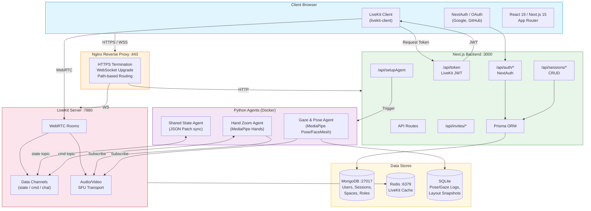
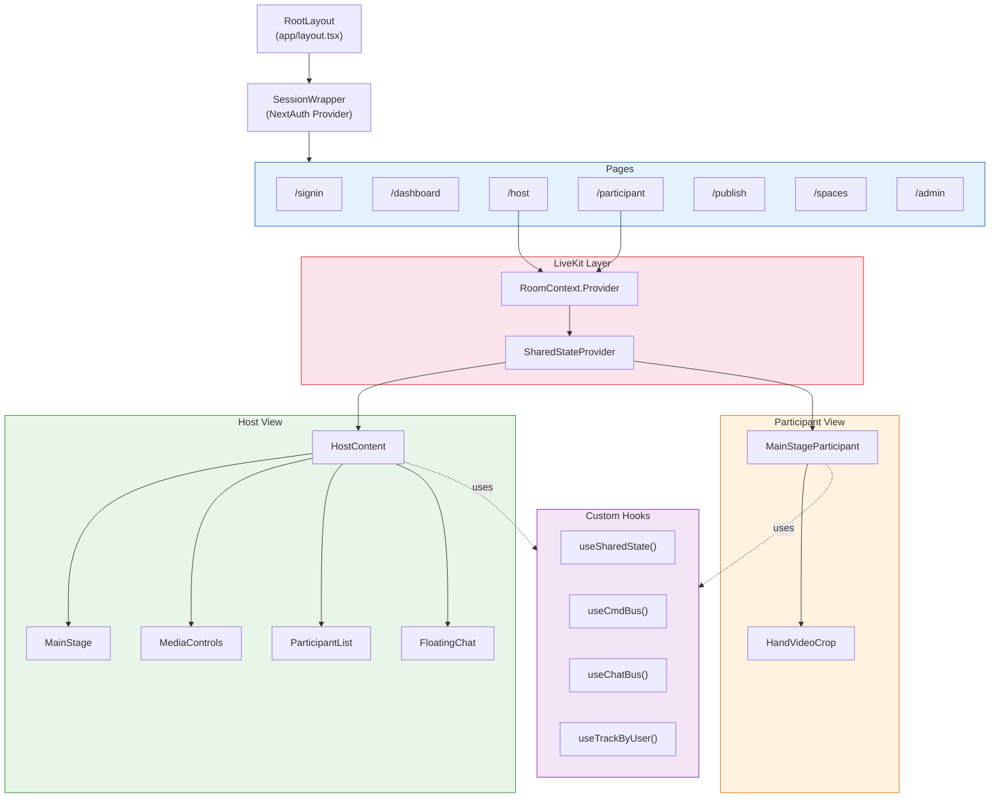
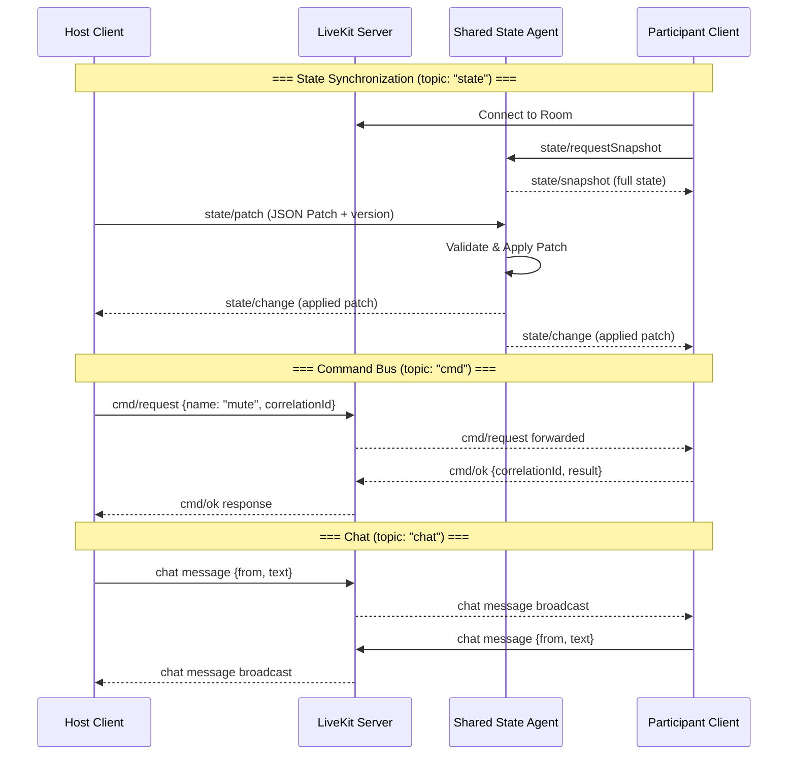
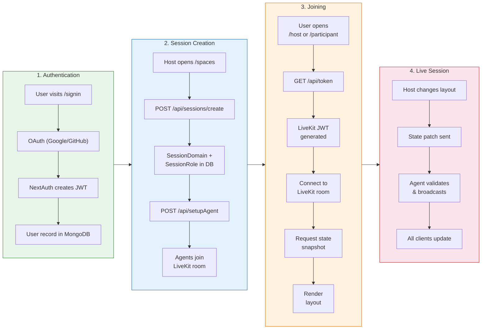
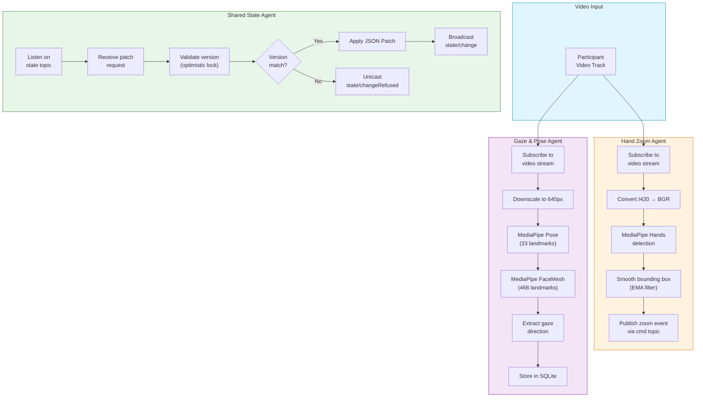
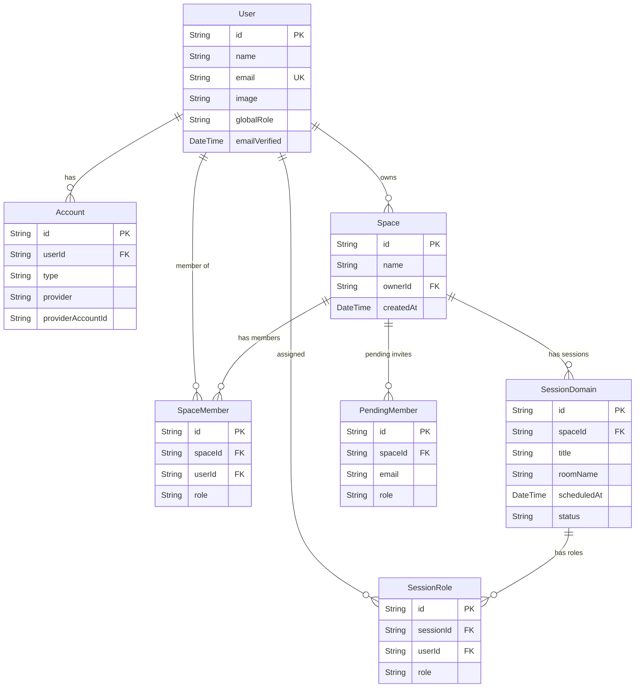
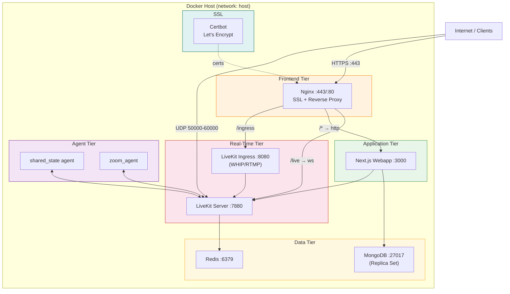
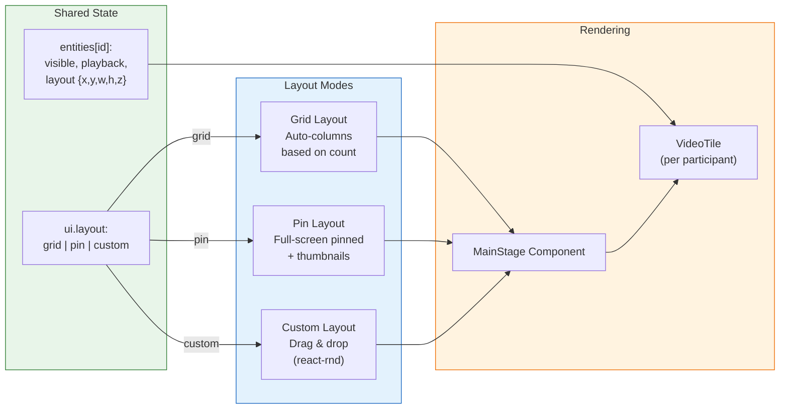
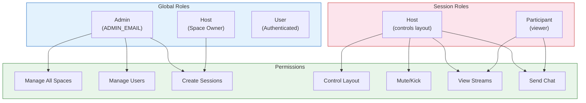

# mediaStage – Architecture Documentation

## Overview

**mediaStage** is a web‑based architecture for advanced real‑time multimedia orchestration, built on top of **LiveKit** and **WebRTC**. It is designed for collaborative and controlled scenarios in which a central authority (the *host*) governs how media streams, layouts, and interactions are composed and experienced by multiple participants.

The system combines a modern **Next.js + React** web interface with a set of **independent Python agents** that provide tracking, synchronization, and data persistence capabilities. Together, these components enable fine‑grained control over audiovisual flows, shared state consistency, and the collection of multimodal signals (pose, gaze, interaction data) for downstream analysis or AI model training.

mediaStage is conceived as a modular and extensible platform, suitable not only for videoconferencing, but also for research, creative collaboration, and future real‑time media experimentation.

---

## Architectural Foundations

At its core, mediaStage relies on **LiveKit** as the real‑time communication backbone, using **WebRTC** for low‑latency audio and video transport. LiveKit rooms act as the central coordination point where browsers and Python agents coexist as first‑class participants.

The architecture follows a clear separation of concerns:

- **Presentation and interaction** are handled by the web client.
- **Orchestration and control** are driven by the host role and propagated through shared state.
- **Computation, tracking, and persistence** are delegated to autonomous Python agents.

This separation allows the system to scale in complexity without tightly coupling UI, media transport, and intelligent processing.

---

## Host / Participant Model

mediaStage adopts a directed videoconference model based on explicit **host** and **participant** roles.

The **host** acts as the authoritative controller of the session. Rather than each participant freely managing their own view, the host determines what is visible, how it is arranged, and which transformations or tracking effects are applied. This model is particularly well suited for guided experiences, presentations, performances, or experimental setups where coherence and synchronization are critical.

Participants, on the other hand, primarily consume the experience defined by the host. Their clients receive layout decisions, visibility rules, and transformation parameters through the shared state mechanism, ensuring that all viewers perceive a consistent and synchronized representation of the session.

---

## Python Agents and Distributed Intelligence

A defining characteristic of mediaStage is its use of **independent Python agents** connected directly to LiveKit rooms. These agents are not embedded services but autonomous processes, each with a focused responsibility.

### Shared State Synchronization Agent

One dedicated agent is responsible for maintaining the **global shared state** of a session. This state represents the authoritative description of the experience and includes information such as:

- The active layout and its parameters
- Which participants are visible or hidden
- Which tracking or interaction modes are enabled
- Session‑wide composition decisions

The agent ensures that all connected clients converge to the same state, resolves conflicts, and propagates updates in a consistent and deterministic manner. This mechanism is fundamental to guaranteeing that all participants remain synchronized despite network variability or client‑side differences.

---

### Tracking Agents

mediaStage supports specialized agents dedicated to real‑time tracking and signal extraction.

Currently, the system includes a **hand‑tracking agent** implemented in Python. This agent detects the position and movement of users’ hands and publishes tracking events into the corresponding LiveKit room.

On the frontend, React components subscribe to these events and translate them into visual transformations, such as dynamic zooming within the browser. The design is intentionally generic, allowing additional trackers (e.g. gaze, body pose, facial expressions) to be integrated with minimal architectural changes.

---

### Persistence and Analysis Agent

Another agent is dedicated to **consistent and synchronized data persistence**. Its role is to record multimodal session data, including:

- User pose
- Gaze direction
- Active layout and composition state

By capturing these signals in a temporally coherent manner, the system enables both real‑time decision‑making and post‑session analysis. This data can later be used to study user behavior, optimize layouts, or train machine learning and AI models.

---

## Web Interface and Frontend Architecture

The web interface is built using **Next.js**, which serves both as the frontend framework and as the backend for session orchestration, authentication, and token generation.

The UI is composed of reusable **React components**, most notably:

- **MediaStage**, responsible for visual composition and rendering. It applies layouts, transformations, and visual effects based on the shared state.
- **MediaControls**, which expose interaction and control capabilities to the host and, where appropriate, to participants.

This component‑based approach allows the visualization logic to remain declarative, reactive, and closely aligned with the underlying shared state.

---

## Host Capabilities

The host is granted comprehensive control over the session. These capabilities include the ability to select and dynamically change layouts, manage individual or global audio states, control participant visibility, and apply tracking effects to specific users.

In practice, the host can mute or unmute individual participants, mute or unmute all users with a single action, show or hide video streams, expel users from the session, and decide which participants are affected by tracking‑based interactions such as hand‑driven zoom.

This centralized control model ensures that the session remains coherent and aligned with the host’s intent at all times.

---

## Business Logic and Session Management

From a business and organizational perspective, mediaStage is structured around **Spaces** and **Sessions**.

A **Super Admin** manages Spaces, which represent logical containers for activity. Each Space can host multiple Sessions. Within a Session, roles are defined, including the host and the participants.

For each session, the system generates a unique access token that routes users to their corresponding web experience. Hosts are authorized to create and delete sessions within their assigned Spaces.

Session creation also triggers the automatic generation of a calendar event and a unique URL, which is distributed to participants via email. This tight integration between session management, scheduling, and access control simplifies coordination and reduces operational friction.

---

## Authentication and Identity

Authentication is based on **OAuth**, currently supporting Google and GitHub as identity providers. Thanks to LiveKit’s ecosystem, additional OAuth providers can be integrated with minimal effort.

Next.js handles authentication flows, user management, and secure token issuance, acting as the backend gateway for all identity‑related operations.

---

## Media Handling and Optimization

### Audio

mediaStage places a strong emphasis on high‑quality audio. The system is configured with a relatively high audio bitrate and intentionally minimizes the use of aggressive filters such as noise suppression and echo cancellation.

This configuration prioritizes natural sound reproduction and low latency, making the platform suitable for scenarios involving music, nuanced audio content, or critical listening.

---

### Video

Video distribution leverages **dynacast** and **multicast** capabilities to adapt efficiently to heterogeneous network conditions. Resolution and bandwidth usage are dynamically adjusted, allowing the system to remain robust even under unstable connections.

Each participant may provide their own media source, which the host can selectively include or exclude from the composed experience.

---

## Layout System

The platform currently supports **grid** and **pin** layouts, which can be selected and modified by the host in real time. The layout system is designed to be extensible, enabling the future introduction of adaptive or AI‑driven layouts that respond to user behavior, tracking signals, or contextual cues.

---

## Future Directions

Looking ahead, mediaStage is designed to evolve toward more advanced synchronization and collaborative scenarios. Planned explorations include the use of **LiveKit Egress** for precise flow synchronization, recording, and analysis.

One envisioned direction is the enablement of tightly synchronized collaborative music or performance scenarios, where participants can observe and evaluate the combined result in real time. Additionally, the growing collection of pose, gaze, and interaction data opens the door to deeper AI‑driven insights and adaptive experiences.
# Start up

At aws instance:

```bash
cd /home/ubuntu/portable-amp/server/
sudo docker compose up -d
```

# mediaStage / Portable AMP - Architecture Diagram

## 1. High-Level System Architecture



## 2. Frontend Component Hierarchy



## 3. Real-Time Communication Protocols



## 4. Data Flow: Session Lifecycle



## 5. Agent Processing Pipeline



## 6. Database Schema (Prisma / MongoDB)



## 7. Docker Deployment Architecture



## 8. Layout System



## 9. RBAC (Role-Based Access Control)


